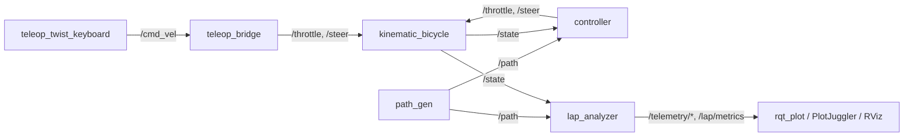

# Bicycle Gym (control_project)

Bicycle Gym is a ROS 2 project in which an autonomous car drives around a racetrack. Controllers regulate the car's speed and keep it on the track. The car is simulated with an extended kinematic bicycle model, in which speed is a state of the vehicle (it builds up through throttle, drag and rolling resistance) and not a directly commanded value.

## Student information

Name: Omar Mohamed Mahmoud

ID: 2500479

# System architecture

The system has three packages:

| Package | Responsibility |
|---|---|
| `bicycle_sim` | Vehicle model, simulator node (`sim_node`), URDF, RViz configuration and the launch file |
| `bicycle_control` | Chooses which controller to run: teleoperation bridge, longitudinal PID, velocity profiler, Lateral PID, Pure Pursuit and MPC |
| `track_environment` | Loads the track CSV, publishes the path and the boundary cones, and runs the lap analyzer |

The system nodes are `teleop_twist_keyboard`, `teleop_bridge`, `kinematic_bicycle`, `controller`, `path_gen`, `lap_analyzer`, and the visualization tools (`rqt_plot`, PlotJuggler and RViz).

The main topics are listed below.

| Topic | Type | Meaning |
|---|---|---|
| `/throttle` | `std_msgs/Float32` | Normalized throttle/brake in [-1, 1] |
| `/steer` | `std_msgs/Float32` | Front steering angle in rad (positive = left) |
| `/state` | `nav_msgs/Odometry` | Rear-axle pose and forward speed |
| `/path` | `nav_msgs/Path` | Track centerline waypoints |
| `/cmd_vel` | `geometry_msgs/Twist` | Keyboard teleoperation command |
| `/telemetry/cte`, `/telemetry/speed`, `/telemetry/heading_err_deg`, `/telemetry/lap_time` | `std_msgs/Float32` | Live signals for plotting |
| `/lap/metrics` | `std_msgs/String` | JSON telemetry (lap, times, speed, CTE, RMS CTE, heading error) |
| `/lap/visualization` | `visualization_msgs/MarkerArray` | Start gate, CTE whisker and HUD text in RViz |




# Mathematical equations

### 1. Extended kinematic bicycle model

The state is $x = [x,\ y,\ \theta,\ v]^T$ and the inputs are $u = [u_{thr},\ \delta]^T$:

$$
\dot x = v\cos\theta,\qquad
\dot y = v\sin\theta,\qquad
\dot\theta = \frac{v}{L}\tan\delta,\qquad
\dot v = k_a\,u_{thr} - c_{drag}\,v^2 - c_{roll}\,v
$$

where $L = 1.25$ m is the wheelbase, $k_a = 4.0\ \mathrm{m/s^2}$ is the powertrain gain, $c_{drag} = 0.005$ is the aerodynamic drag coefficient and $c_{roll} = 0.05$ is the rolling resistance coefficient.

Forward Euler integration with step $\Delta t = 0.1$ s:

$$
x_{k+1} = x_k + \dot x_k\,\Delta t
$$

After each step, the heading is wrapped to $[-\pi, \pi]$ and the speed is clamped to $[0, 25]$ m/s, so braking can stop the car but never reverse it. The states of the car are therefore its coordinates $(x, y)$, its heading angle and its speed, and its inputs are the throttle and the steering angle.

### 2. Teleoperation bridge

The bridge is an open-loop controller. It receives a `geometry_msgs/Twist` message on `/cmd_vel` (from the keyboard) and converts it to a throttle and a steering angle in the allowed ranges: throttle in $[-1, 1]$ and steering within $\pm\delta_{max}$ (35°).

$$
u_{thr} = \mathrm{clip}\left(\frac{v_{cmd}}{5.0}, -1, 1\right),\qquad
\delta = \mathrm{clip}\left(\frac{\omega_{cmd}}{1.0}\,\delta_{max}, -\delta_{max}, \delta_{max}\right)
$$

A **watchdog** runs at 10 Hz: if the last Twist is older than 0.5 s, the throttle and the steering are set to zero. Zero throttle is *not* braking, so the car coasts down slowly.

### 3. Longitudinal PID with anti-windup

First the speed error is calculated, $e_v = v_{target} - v$, and then:

$$
u_{thr} = \mathrm{clip}\Big(K_p e_v + K_i \int e_v\,dt + K_d \frac{de_v}{dt},\ -1,\ 1\Big)
$$

The gains are $K_p = 1.0$, $K_i = 0.2$ and $K_d = 0.05$. **Anti-windup:** the integral state is clamped to $\pm 2.0$, so it cannot grow without bound while the throttle is saturated. A negative output brakes the car. This makes the car settle at the required speed with a small overshoot.

### 4. Velocity profiler

The path curvature $\kappa$ is estimated from the heading change over the neighboring waypoints, $\kappa \approx \Delta\psi / \Delta s$. The speed limit comes from a lateral-acceleration bound $a_{lat,max} = 5\ \mathrm{m/s^2}$:

$$
v_{max} = \min\!\left(\sqrt{\frac{a_{lat,max}}{|\kappa|}},\ v_{cap}\right),\qquad v_{cap} = 7.5\ \mathrm{m/s}
$$

If the curvature is unavailable, the default speed (4.0 m/s) is used. This target speed feeds the longitudinal PID, so the car slows down in sharp turns and speeds up on straights, up to the 7.5 m/s cap.

### 5. Cross-track error and heading error

For the nearest path segment, the signed CTE is positive when the car is to the left of the path (sign of the cross product $d_x(y-y_1) - d_y(x-x_1)$), and the heading error is $\psi_{err} = \mathrm{wrap}(\theta - \psi_{path})$.

### 6. Lateral PID

The steering is calculated from the CTE and the heading error. A car to the left of the path (positive CTE or heading error) must steer right (negative angle), so the whole sum is negated:

$$
\delta = -\Big(K_p\,e_{ct} + K_i\!\int e_{ct}\,dt + K_d\,\dot e_{ct} + K_\psi\,\psi_{err}\Big)
$$

with $K_p = 0.8,\ K_i = 0.02,\ K_d = 0.15,\ K_\psi = 0.5$, the integral clamped to $\pm 1$, and the output clipped to $\pm 35^\circ$.

This equation steers the car back toward the path and corrects its heading angle, so the lateral error is minimized.

### 7. Pure Pursuit

The lookahead distance is adaptive: $L_d = \mathrm{clip}(k_v v + l_{min},\ l_{min},\ l_{max})$ with $k_v = 0.25$, $l_{min} = 0.8$ m and $l_{max} = 2.5$ m. The target point is the first waypoint, walking forward from the nearest one, that is at least $L_d$ meters away. After transforming it into the vehicle frame ($x$ forward, $y$ left),

$$
\alpha = \mathrm{atan2}(y_{local},\ x_{local}),\qquad
\delta = \mathrm{atan2}\left(2L\sin\alpha,\ L_d\right)
$$

This gives the steering angle for which the car follows a circular arc that ends at the lookahead point, so the car is continuously steered toward a point ahead on the path.

### 8. Extended kinematic MPC

At every step a nonlinear program is solved over $N = 10$ steps ($\Delta t = 0.1$ s) for the inputs $u = [\delta_0, a_0, \dots, \delta_{N-1}, a_{N-1}]$, using the same bicycle model with speed as a state ($v \leftarrow v + a\,\Delta t$). The tracking errors are projected into the path-aligned (Frenet) frame of each reference point $(x_r, y_r, \psi_r, v_r)$:

$$e_{lat} = -\sin\psi_r\,(x-x_r) + \cos\psi_r\,(y-y_r),\qquad e_{lon} = \cos\psi_r\,(x-x_r) + \sin\psi_r\,(y-y_r)$$

$$J = \sum_{k=0}^{N-1} w_{lat}e_{lat}^2 + w_{lon}e_{lon}^2 + w_{\psi}e_{\psi}^2 + w_v e_v^2 + w_\delta\delta_k^2 + w_{\Delta\delta}(\delta_k-\delta_{k-1})^2 + w_a a_k^2$$

The weights are $w_{lat}=30,\ w_{lon}=1,\ w_\psi=10,\ w_v=1,\ w_\delta=0.2,\ w_{\Delta\delta}=6,\ w_a=0.1$. The bounds are $\vert\delta\vert \le 35^\circ$ and $\vert a\vert \le k_a$. The solver is SciPy SLSQP (25 iterations, `ftol` 1e-3) with a **warm start** from the previous solution shifted by one step. Only the first control is applied (**receding horizon**), and the throttle is $u_{thr} = a_0 / k_a$.

### 9. Lap analyzer

The analyzer projects the car onto the path, accumulates |CTE| and speed for each lap, and detects a lap when the progress along the path wraps from the last quarter to the first quarter of the track. For each lap it prints the lap time, the mean / RMS / max CTE, the mean / max speed and the total distance. It also publishes live telemetry (the `/telemetry/*` and `/lap/metrics` topics from the topic table) and draws a CTE whisker (green to red) and a text HUD in RViz.

# Benchmark

### Leaderboard

| Controller | Best lap (s) | Top speed (m/s) | Mean CTE (m) | RMS CTE (m) | Max CTE (m) | Laps / status |
|---|---|---|---|---|---|---|
| Manual teleoperation | 149.00 | 13.14 ¹ | 1.13 | 1.58 | 8.76 | 3 laps over 2 sessions, with off-track excursions |
| Lateral PID (reactive) | 81.10 | 7.62 | 0.40 | 0.56 | 3.08 | 3 |
| Pure Pursuit (preview) | 71.99 | 7.41 | 0.042 | 0.064 | 0.385 | 5 |
| Extended kinematic MPC (fixed 4 m/s) | 121.80 | 3.94 | 0.073 | 0.098 | 0.368 | 3 |
| *Pure Pursuit, fixed 4 m/s (supporting run)* | *111.20* | *4.29* | *0.026* | *0.050* | *0.331* | *2* |

¹ A one-off peak when the keyboard speed setting was raised too high. The cleanest manual lap peaked at 5.19 m/s.

### Per-lap data

**Lateral PID**

| Lap | Time (s) | CTE mean / RMS / max (m) | Speed mean / max (m/s) | Distance (m) |
|---|---|---|---|---|
| 1 | 82.10 | 0.381 / 0.537 / 2.236 | 5.90 / 7.62 | 483.9 |
| 2 | 81.10 | 0.370 / 0.505 / 1.877 | 5.96 / 7.51 | 483.8 |
| 3 | 81.57 | 0.446 / 0.646 / 3.082 | 6.02 / 7.49 | 491.6 |

**Pure Pursuit (curvature profile)**

| Lap | Time (s) | CTE mean / RMS / max (m) | Speed mean / max (m/s) |
|---|---|---|---|
| 1 | 73.10 | 0.040 / 0.061 / 0.356 | 6.10 / 7.41 |
| 2 | 71.99 | 0.043 / 0.066 / 0.357 | 6.18 / 7.40 |
| 3 | 72.30 | 0.043 / 0.064 / 0.383 | 6.16 / 7.40 |
| 4 | 72.30 | 0.043 / 0.065 / 0.385 | 6.16 / 7.40 |
| 5 | 72.51 | 0.042 / 0.062 / 0.384 | 6.14 / 7.40 |

**MPC (fixed 4 m/s)**

| Lap | Time (s) | CTE mean / RMS / max (m) | Speed mean / max (m/s) |
|---|---|---|---|
| 1 | 122.40 | 0.073 / 0.098 / 0.340 | 3.66 / 3.93 |
| 2 | 121.80 | 0.074 / 0.101 / 0.362 | 3.67 / 3.94 |
| 3 | 121.80 | 0.071 / 0.094 / 0.368 | 3.68 / 3.93 |

**Pure Pursuit (fixed 4 m/s, supporting run)**

| Lap | Time (s) | CTE mean / RMS / max (m) | Speed mean / max (m/s) |
|---|---|---|---|
| 1 | 111.30 | 0.026 / 0.050 / 0.308 | 4.00 / 4.29 |
| 2 | 111.20 | 0.025 / 0.049 / 0.331 | 4.00 / 4.00 |

**Manual teleoperation**

| Lap | Time (s) | CTE mean / RMS / max (m) | Speed mean / max (m/s) | Distance (m) |
|---|---|---|---|---|
| Session 1, lap 1 | 303.30 | 1.697 / 2.176 / 8.755 | 1.53 / 13.14 | 464.8 |
| Session 2, lap 1 | 264.90 | 0.782 / 1.308 / 5.021 | 1.72 / 3.99 | 455.6 |
| Session 2, lap 2 | 149.00 | 0.920 / 1.245 / 3.938 | 3.02 / 5.19 | 449.4 |


# Controller comparison

* **Lateral PID** is the simplest and cheapest controller, but it is reactive: it only reacts to an error that has already happened (it makes an error, then corrects it). It also has no preview of the road ahead, so it had the worst tracking among the autonomous controllers (mean CTE ≈ 0.40 m, max 3.08 m).

* **Pure Pursuit** had the best tracking and the fastest laps (mean CTE ≈ 0.042 m, 72 s per lap). Its lookahead point averages out the waypoint noise and gives a smooth movement along the path. Its disadvantage is that it is purely geometric, so it ignores the vehicle dynamics and the actuator limits.

* **MPC** is the most capable controller in theory and the most expensive to compute. It had the lowest maximum CTE, but its mean and RMS errors were higher than Pure Pursuit's, even at the same speed of 4 m/s (see the leaderboard above).

* **Manual driving** was the worst overall: it had the largest errors and left the path many times.

**Important note:** the MPC and Pure Pursuit did not run at the same speed in the main benchmark. I therefore ran another test in which Pure Pursuit drove at a fixed 4 m/s, and Pure Pursuit still tracked the path better than the MPC.

# Why MPC should track better than Pure Pursuit and Lateral PID

* **MPC vs. Lateral PID:** a feedback controller (Lateral PID) can only react after an error has appeared, and its performance depends on its tuning. MPC predicts how the car will move over the next steps and chooses the best commands. It applies only the first command and then calculates again.

* **MPC vs. Pure Pursuit:** Pure Pursuit looks at a single point and treats steering as a geometric problem, so it does not take the actuator limits into account while planning. MPC uses the vehicle model over a time horizon and gives weights (costs) to the heading error, speed, lateral error and steering rate.

**Measured result:** in this project, MPC was worse than Pure Pursuit in mean and RMS error. Possible reasons (not tested) are the many zigzag reference points and the short horizon (10 steps). MPC could be better if the path were smoother or if its weights were tuned.

# Milestone 6: Free exploration


## 1. Four-wheel Ackermann kinematics

Before controlling the robot, we should know how to make a kinematic model that mathematically describes the motion (steering, velocity, position and orientation). First kinematics describes the wheel movement, velocity of the robot, robot position and its orientation without considering the forces and the mass of the robot. There are 2 main types of kinematics forward and inverse. The forward kinematics is that the robot uses wheel velocities to determine the movement of the robot (velocity and orientation). Inverse kinematics is that giving the robot a desired movement and it calculates the steering angle and the wheel velocity. Types of wheeled robots is omnidirectional robots which can move in any direction in the plane like the omni-wheel robots and the swerve-drive robots. The other type is nonholonomic robots which cannot move in any direction (it cannot move sideways) so we use some models to control it like the bicycle, differential-drive, tricycle and Ackermann models. The frames also are an important thing in describing the movement of the robot as we have two important frames. The first one is the world frame which is fixed in the environment the other type is the body frame which is attached to the robot and is used to express the velocity and orientation of the robot according to it. Unicycle model is demonstrating the motion in forward velocity which determines how quickly the position of robot is changing also it demonstrate the heading which determines the direction of movement and also demonstrate angular velocity which changes the heading. Differential drive robots are robots which have two independently driven wheels which have forward velocity and angular velocity with knowing the distance between the two wheels. One of the most important models is the bicycle model as it simplifies the four wheels into a front wheel and a rear wheel. It contains one steering angle and one driving velocity with knowing the distance between the two wheels. It assumes there is no-slip as the equations are based on ideal kinematic behaviour. The turning angle is important also in the kinematics of the car as small angle gives larger turning radius and vice versa. Double-traction axle makes the two rear wheels independent as each wheel must have different speeds when turning because each wheel has different radius path. Ackermann steering like the real (normal) car has two front steering wheels as each front wheel shouldn’t have same steering angle because the inner wheel (the nearest to the turn) follows smaller radius than the outer wheel.

Ros 2 provides steering controllers’ libraries. It is used for nonholonomic robots as it takes the desired vehicle motion and convert it into steering and traction commands. One important thing here is that the controller doesn’t decide how the car should follow a track as it uses the inverse kinematics not feedback loops such as path-tracking controllers. The controller receives the desired motion in a twist stamped message contain the velocity and the angular velocity then it uses kinematic model like (bicycle, Ackermann, …) to calculate the wheel traction and steering joint position. It also declares names for joints (steering and driving) and support bicycle, tricycle and Ackermann models. The controller also receives information back from the robot to estimate odometry (using wheel encoders and the kinematic model to estimate the position of the car and its orientation). The controller also has parameter called reference timeout for safety which is when the controller stops receiving commands for a specific time it resets the command so if the controller crashed or something happened the robot stops safely instead of moving as the last command continuously.

Carlike Bot is an example for robot to illustrate the workflow. The robot has physically four wheels so it uses bicycle model to simplify the calculation. It uses a virtual front wheel joint for steering and a virtual rear wheel joint for traction. It receives the twist stamped message then calculates the steering and traction commands and gives feedback to adjust the next commands then sends it to odometry. It is also visualized in RViz.


## 2. 3D simulation: Gazebo and MVSim

Simulation is very important in testing the controller of autonomous cars. That is because it saves time and provide more safety. We use in simulations some systems and programs to make the system of the autonomous robot. ROS 2 one of the most important things here as it connects the different parts of the robot easily. Also, ROS 2 provides topics which allow the controller to communicate with the vehicle’s actuators. The controller calculates a command, ROS 2 transports that command, and Gazebo's vehicle model/simulation applies it and simulates the resulting motion to make the tester see what will happen to the vehicle to asses the controller’s performance or any other systems. Also, Waypoints can be created from the vehicle's position and used to represent a planned path (points that represent the path) and then some controllers like pure pursuit which uses lookahead point (the car selects a specific point ahead to drive to it).

We have two simulators which are used in simulations and they are Gazebo and MVSim. Gazebo is a simulating environment where the vehicle and the environment could be tested. MVSim is as focused more on mobile robots and many vehicles simulation. We could also use some sensors like lidars, cameras and IMU to get the data from the environment to make the car drive fully automated.

[IMAGE: optional screenshot for this topic — save it as `assets/gazebo.png`]

## 3. Nav2 MPPI control

MPPI is a predictive local controller that generate many trajectories by sampling. It evaluate them by using its criteria and its constrains and give each one a cost. MPPI uses the costs of the sampled trajectories to calculate an improved control sequence, then applies the current control command and repeats the process and implement it then it generates possible trajectories again. Some of the critics are path following, goal distance, velocity constraints and obstacle avoidance. This process is repeated continuously as the robot is moving which allow the controller to react with the environment. The prediction horizon is the total time that the controller predicts. The prediction horizon is divided into discrete time steps. For example, with 56 steps and a time interval of 0.05 seconds, the controller predicts approximately 2.8 seconds into the future.

The difference between MPPI and the MPC is that MPC uses mathematical optimization problem to solve the best control sequence. MPPI it will sample many trajectories, simulate them and give each of them a cost and uses the costs of the sampled trajectories to calculate an improved control sequence, then applies the current control command and repeats the process.

[IMAGE: optional screenshot for this topic — save it as `assets/mppi.png`]

# Reproduction guide

Tested on Ubuntu 22.04 (WSL2 on Windows) with ROS 2 Humble.

```bash
# 1. Dependencies
source /opt/ros/humble/setup.bash
sudo apt update && sudo apt install -y python3-colcon-common-extensions python3-numpy python3-scipy \
  ros-humble-robot-state-publisher ros-humble-rviz2 ros-humble-xacro \
  ros-humble-teleop-twist-keyboard ros-humble-plotjuggler-ros ros-humble-rqt-plot

# 2. Build
cd /path/to/workspace        # the folder containing src/ with the three packages
colcon build --symlink-install
source install/setup.bash
```

**Run each mode** (one launch at a time; stop the previous one with Ctrl+C first):

| Mode | Command |
|---|---|
| Base simulation | `ros2 launch bicycle_sim bicycle_sim.launch.py` |
| Manual teleoperation | `ros2 launch bicycle_sim bicycle_sim.launch.py controller:=teleop use_cruise_control:=true`, then `ros2 run teleop_twist_keyboard teleop_twist_keyboard` |
| Lateral PID | `ros2 launch bicycle_sim bicycle_sim.launch.py controller:=lateral_pid` |
| Pure Pursuit | `ros2 launch bicycle_sim bicycle_sim.launch.py controller:=pure_pursuit` |
| MPC | `ros2 launch bicycle_sim bicycle_sim.launch.py controller:=mpc` |

Add `rviz:=false` to run without the RViz window. The lap analyzer prints a summary banner after every lap.

**Direct actuator test (Milestone 2):**

```bash
ros2 topic pub -r 10 /throttle std_msgs/msg/Float32 "{data: 0.5}"
ros2 topic pub -r 10 /steer std_msgs/msg/Float32 "{data: 0.30}"
```

**Live plots:**

```bash
ros2 run plotjuggler plotjuggler
ros2 run rqt_plot rqt_plot /telemetry/cte /telemetry/speed
```

**Reproducing the benchmark.** Make sure `ros2 node list` is empty before every run (leftover processes from a previous run corrupt the lap statistics), run a mode for at least three laps, and read the lap banners printed in the launch terminal.

### Known issues and tips

* Stale processes: after a crash, kill the leftovers (`pkill -f "bicycle_ws/install"`) and check `ros2 node list`.
* The lap timer starts at the first `/state` message, so start the controller before the simulation, or ignore the first lap.
* On WSL2, RViz may fail to open after a long session; `wsl --shutdown` or `LIBGL_ALWAYS_SOFTWARE=1` helped.

# Repository layout

```
bicycle_sim/          vehicle model, simulator node, URDF, RViz config, launch file
bicycle_control/      teleop bridge, PID, velocity profiler, Lateral PID, Pure Pursuit, MPC, controller node
track_environment/    track CSV, path generation, lap analyzer
assets/               images used in this README
```

# Video

[LINK TO THE 3 TO 5 MINUTE VIDEO]
